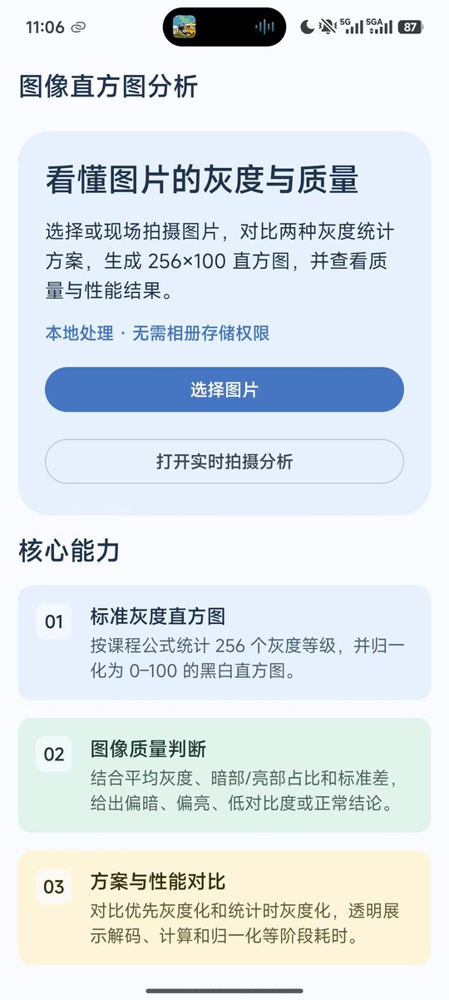
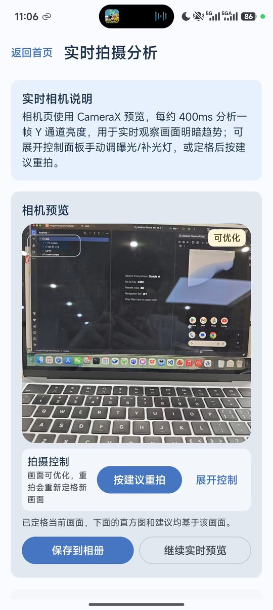
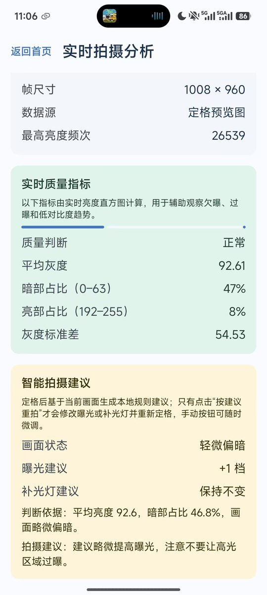
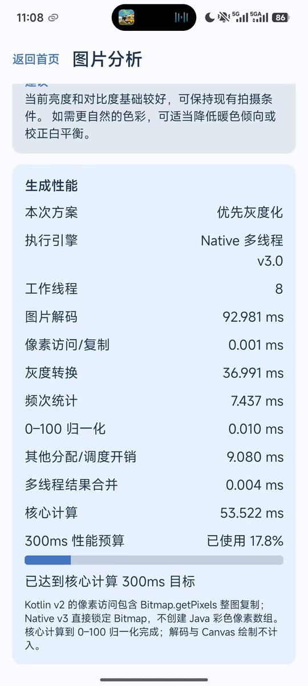
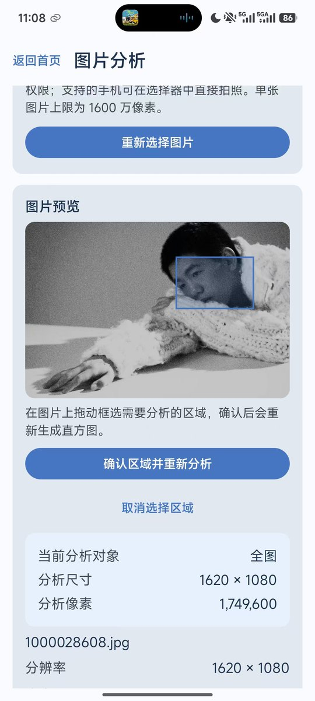
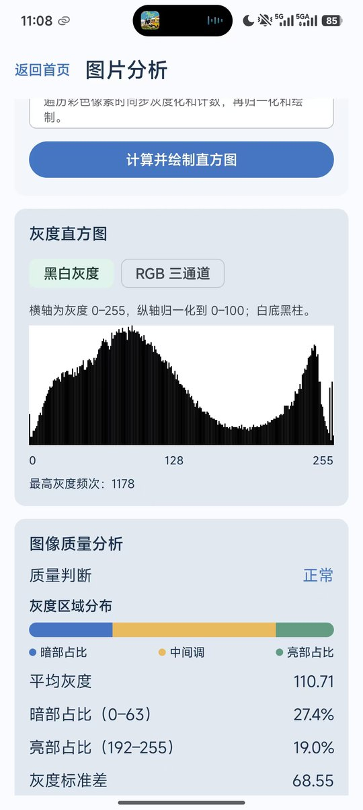

# ImageHistogramAnalyzer

杭州电子科技大学短学期“图像直方图计算及性能优化”课程项目：一款离线运行的 Android 图像质量分析与智能拍摄辅助 App。

项目使用 Kotlin、Jetpack Compose、Material 3、CameraX 与 NDK/C++，从课程要求的 256×100 灰度直方图出发，完成静态图片分析、RGB 分布、ROI 局部分析、图像质量解释以及实时相机拍摄反馈。

## 项目亮点

- **课程指标可验证**：严格使用 `gray = red × 0.299 + green × 0.587 + blue × 0.114`，输出 256 个灰度频次并归一化到 0–100。
- **两条计算路径**：实现“优先灰度化”和“统计时灰度化”，并用测试保证两者结果一致。
- **从 Kotlin 到 Native**：v3.0 通过直接锁定 Bitmap、C++ 行分块、多线程私有直方图和最终归并，避免 Java 整图像素数组复制。
- **真机达到目标**：Xiaomi 14、12.58MP 测试图、Native v3.0、8 工作线程的一次封版记录为 **30.661ms**，低于课程要求的 300ms。该数值是指定设备与样本记录，不代表所有设备的统一性能。
- **不仅展示数字**：提供灰度/RGB 曲线、平均灰度、暗亮部占比、标准差、色偏和自然语言质量建议。
- **智能拍摄助手**：CameraX 实时亮度直方图、三色质量状态、定格分析、保存相册、曝光微调、补光灯与按建议重拍。
- **局部分析**：支持框选 ROI 后重新生成直方图与质量结论，并可恢复全图。
- **完整工程证据**：封版功能总表覆盖 21 项功能检查，结果均记录为通过；代码、测试、性能口径、文档和答辩材料保持同步。

## 运行效果

| 首页 | 实时拍摄 | 拍摄建议 |
|---|---|---|
|  |  |  |

| RGB 与性能 | ROI 局部分析 | 灰度与质量分析 |
|---|---|---|
|  |  |  |

演示视频说明见 [demo/README.md](demo/README.md)。原始竖屏视频约 285MB，不纳入 Git；公开发布地址可在发布后补入该页。

## 技术栈与结构

```text
Android / Kotlin / Jetpack Compose / Material 3
ViewModel + StateFlow / Coroutines
CameraX / Bitmap / Compose Canvas
JNI + C++ multithreading
```

```text
app/src/main/
├── java/.../data       # 图片解码、CameraX 与设备控制
├── java/.../domain     # 直方图、质量判断、ROI、拍摄建议
├── java/.../ui         # 页面、状态与可复用 Compose 组件
└── cpp                 # Native Bitmap 访问与并行统计
```

项目保持单模块、离线和本地计算，不包含登录、数据库、后端或云服务。

## 构建与运行

环境建议：Android Studio、JDK 17、Android SDK，以及由 Gradle 自动配置的 NDK/CMake。

```bash
git clone git@github.com:LiPume/ImageHistogramAnalyzer.git
cd ImageHistogramAnalyzer
./gradlew :app:assembleDebug
```

APK 位于 `app/build/outputs/apk/debug/`。Windows 组员使用仓库自带的 `gradlew.bat`；`local.properties` 不随 Git 分发，需要 Android Studio 在本机生成。

验证命令：

```bash
./gradlew :app:testDebugUnitTest :app:assembleDebug \
  :app:assembleDebugAndroidTest :app:lintDebug
```

## 文档与成果

- [最终开发文档入口](docs/final/README.md)
- [功能全景与测试基线](docs/当前功能全景与测试规划基线.md)
- [迭代计划与 TODO](docs/迭代计划与TODO.md)
- [算法与性能优化说明](docs/final/05-算法与性能优化说明.md)
- [测试计划与测试用例](docs/final/06-测试计划与测试用例.md)
- [封版功能测试总表](docs/performance/第十四组_按功能测试总表.xlsx)
- [课堂汇报 PPTX](docs/final/第十四组_ImageHistogramAnalyzer_课堂汇报.pptx)
- [版本记录](CHANGELOG.md)

## Skill-driven Vibe Coding

本项目把 Vibe Coding 当作“受规则约束的协作开发”，而不是一键生成：成员负责需求取舍、公式确认、真机验证和验收，Agent 负责加速实现、回归检查与文档同步。

- `image-histogram-android`：约束课程边界、架构、算法与性能口径。
- `android-test-gate`：每个代码切片匹配相应测试与构建门禁。
- `project-doc-sync`：实现、TODO、使用说明和测试报告同步。
- `project-git-checkpoint`：显式暂存、验证后提交和可回退封版。
- `course-presentation`：从可追踪证据生成并检查答辩材料。

第三方仓库只用于学习技术思路，未直接复制到 App 源码；详见[开源项目技术借鉴记录](docs/开源项目技术借鉴记录.md)。

## 学术诚信与使用边界

本仓库用于课程成果展示与技术交流。引用、改编或复用时请注明来源，并遵守所在课程的学术诚信要求。团队成员信息与答辩文档按课程交付场景保留；请勿将其用于无关用途。
