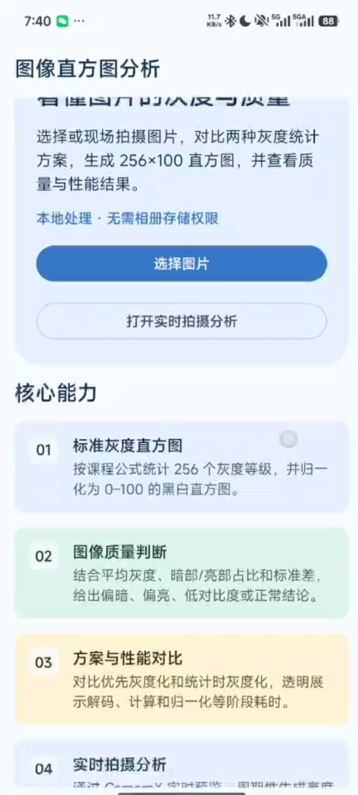

# 项目演示视频

封版演示视频为 720×1600 竖屏录制，时长约 5 分 7 秒，覆盖首页、静态图片分析、RGB/ROI、性能数据以及 CameraX 智能拍摄辅助。

- 小红书发布地址：`[发布后填写]`
- 本地原始文件：`demo/系统演示视频720p.mp4`

原视频约 285MB，超过 GitHub 普通仓库 100MB 单文件限制，因此由 `.gitignore` 排除。仓库只保留封面、功能截图、源码和可追踪文档。
